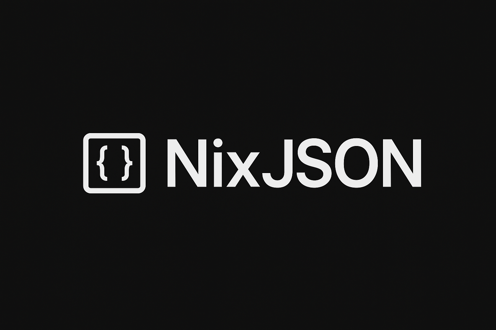

---
**NixJSON** é uma biblioteca minimalista em **C** para leitura e parsing de arquivos **JSON**, projetada para ser leve, rápida e fácil de integrar.
Apenas para fins didaticos. Não aborda todos os tipos de json.
---

## Características
- Leitura e parsing de JSON puro em C
- Estrutura de dados simples e eficiente
- Código limpo e bem documentado
- Suporte a valores aninhados e arrays
---

## Estrutura do projeto

```
nixjson/
├── include/           # Headers públicos
├── src/               # Implementação da biblioteca
├── examples/          # Exemplos de uso
│   ├── example1.c
│   └── data.json
├── CMakeLists.txt     # Configuração principal
└── README.md
```

---
## Instalação
Clone o repositório e compile os arquivos `.c` normalmente:

```bash
git clone https://github.com/juliodf24/NixJson.git
cd nixjson
mkdir build && cd build
cmake ..
make
```

Resultado:
```
libnixjson.a     # biblioteca estática
libnixjson.so    # biblioteca compartilhada
nixjson_example  # exemplo de uso
```

---

## Usando em outro projeto com CMake

Se quiser incluir **NixJson** remotamente em seu repositório, adicione ao seu `CMakeLists.txt`:

```cmake
include(FetchContent)
FetchContent_Declare(
  nixjson
  GIT_REPOSITORY https://github.com/juliodf24/NixJson.git
  GIT_TAG (versão)
)
FetchContent_MakeAvailable(nixjson)

target_link_libraries(seu_executavel PRIVATE nixjson)
```

>  Assim, o CMake baixa automaticamente a lib e a compila junto com seu projeto.

---

## Sobre

Criado por **Júlio César**.

> *NixJSON: JSON parsing no estilo C — simples e direto.*
